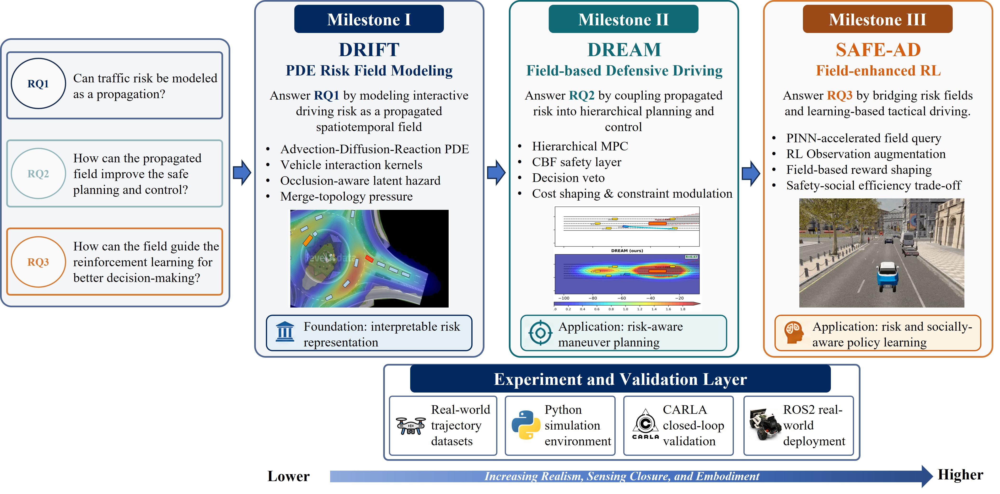
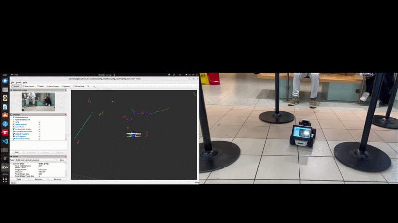

<h1 align="center">Hi, I'm Zian Wang Peter (王梓安)👋</h1>
<h3 align="center">Researcher in Robotics & Autonomous Driving & Intelligent Transportation Systems</h3>

  
  
  

I am currently pursuing an M.Phil. degree with [Department of Data and Systems Engineering](https://www.dase.hku.hk/) at the University of Hong Kong, supervised by [Prof. Chen Sun](https://scholar.google.com/citations?user=LdBn-p4AAAAJ&hl=zh-CN). Our research group is called [HKU-SAS Lab](https://github.com/SAS-HKU). 

Prior to joining HKU, I received the B.Eng. degree (with Honors) in Electronic and Information Engineering from [Department of Electrical and Electronic Engineering](https://www.polyu.edu.hk/eee/?sc_lang=en), The Hong Kong Polytechnic University in 2025.

---

### 🔥 Recent News  
- 📆 **2026.05** - I will serve as the chairperson of student committee of [HKU Institute of Transport Studies](https://www.institute-of-transport-studies.hku.hk/) from term 2026-2027. Stay tuned for more seminars to come!
- ✅ **2026.05** – First manuscript accepted at **[IEEE ITSC 2026](https://ieee-itsc.org/2026/)**! 🎉  
- 🎤 **2026.03** – Gave my first [academic seminar at HKU Institute of Transport Studies](https://www.institute-of-transport-studies.hku.hk/post/student-seminar-by-mr-zian-wang-peter-on-mar-11-2026-1pm) 
- 🚀 **2025.09** – Started M.Phil. at [HKU Dept. DASE](https://www.dase.hku.hk/) and joined HKU‑SAS Lab.

---
### 🚀 Research Interests  
- **Risk‑aware autonomous driving** – defensive maneuver planning, risk field inference, human‑like behavior  
- **Safe reinforcement learning & physics‑informed learning** for intelligent transportation systems  
- **Human‑machine interaction** and multi‑modal perception in dynamic environments  
My research pipeline so far:

---
### 📌 Highlight Projects  
<!-- Replace links with your actual repository URLs -->
- 🚗 **[DRIFT – Risk Field Propagation for Autonomous Driving](https://github.com/PeterWANGHK/DRIFT)**  
- 🛡️ **[DREAM – Defensive Risk‑Aware Planner](https://github.com/SAS-HKU/DREAM)**
- 🛡️ **[SAFE-AD – Social and Risk‑Aware RL for Autonomous Driving](https://github.com/PeterWANGHK/SAFE-AD.git)**
- 📚 **[HKU DASE Course Materials](https://github.com/SAS-HKU/DASE7505_student)**  

example demonstrations:
1. field-based socially-aware autonomous navigation in crowded environments:

---

  <i>Let’s connect! Feel free to reach out for collaborations or discussions.</i>

